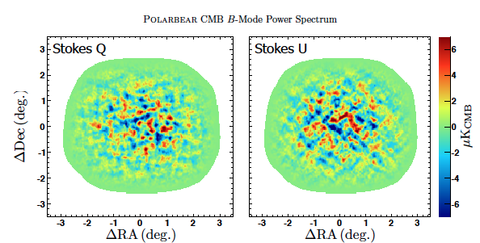

---
title:	ASTRO 250 Final Project
subtitle:	Spring 2017, University of California, Berkeley
author:	Kolen Cheung
date:	\today
abstract:	Abstract here.
keywords:	ASTRO250, Parallel Computing, POLARBEAR, CMB, final project
lang:	en
papersize:	letter
fontsize:	12pt
documentclass:	memoir
classoption:	article
geometry:	inner=1.5in, outer=1.5in, top=1.5in, bottom=1.75in
fontfamily:	fourier
usepackage:	siunitx,cancel,physics,placeins
hypersetup:	bookmarksnumbered,pdfpagelabels,pagebackref,hypertexnames=false,linktocpage=true
colorlinks:	true
linkcolor:	blue
citecolor:	blue
urlcolor:	blue
toccolor:	blue
header-includes: |
	\usepackage{siunitx}
...

# Introduction

Physicists always push the boundary of our understanding of the most fundamental aspects of the Universe. Some of the fundamental questions we can ask are what constitute the Universe; how gravity plays a role in quantum Physics; why neutrino mass are non-zero, how much mass do they have, and how many numbers of them; and if the current understanding of the Universe through $\Lambda$-CDM model is correct.

Many of such questions can only be answered when we probed at higher and higher energy scales. For example, the highest energy scale we can achieve artificially in the state-of-the-art LHC is about ~ $\SI{10}{\TeV}$, or $\SI{10e13}{\eV}$. But we can do only so much experimentally because of the limit of the size of the equipment we can build, and it is unlikely for the foreseeable future to create energy scale as high as the GUT scale at ~ $\SI{10e16}{\GeV}$, or $\SI{10e25}{\eV}$, which will be important for Quantum Gravity.

So instead of relying on human-built machine, one can measure the primordial signals created by the Universe itself. And the oldest possible such signal that is observable is the Cosmic Microwave Background (CMB) Radiation. It is the first light of the Universe when it was ~ $400000$ years young, and everything happened between now and then are imprinted in this signal. Some of the information we can extracts includes gravitational wave at GUT scale (by B-mode analysis on the CMB), dark matter, neutrino mass, falsification of $\Lambda$-CDM model, etc.

POLARBEAR, which is one of the pioneer group on the measurement of CMB polarization in University of California, Berkeley, has conducted about 2 years of observations. One of the major result by POLARBEAR in 2014 is<!-- \cite{Collaboration:2014eg} -->

> the hypothesis of no B-mode polarization power from gravitational lensing is rejected at $97.2\%$ confidence

\ 

But in order to extract more information from the huge amount of data collected, we need to do a so called high-$l$ analysis. Previously, the resolution of the map shown above is made with a lower resolution than the telescope is capable of. We want to analyze the CMB in full resolution from the telescope data, which is much more computational intensive and requires much more scratch disk space.

# Algorithm

The majority of the algorithms involved are custom-deigned for the experiments, which relies on existing libraries such as Numpy. On NERSC, Intel's Distribution of Python (with Anaconda) is used, and therefore those libraries such as Numpy are built with OpenMP and SIMD support.

Among the custom codes, there are 2 major bottleneck:

1. pseudo-power spectrum (computational intensive),
2. weighted averages and statistics (huge intermediate write on scratch disks).

The followings layout the plan to solve these 2 problems.

# Parallelization and Scalability

Although many functions from different libraries are used, and OpenMP and SIMD support are built in from the Intel's Distribution of Python, there are also many custom Python/C code that is custom built, and unfortunately are all in serial due to historical reasons.

Part of this project is to study the viability of rewriting the code in Cython instead. Cython is a superset of Python which can be translated into C/C++ code and compiled. Because of that, we can continue to write Pythonically when performance is not critical, but in C-style if performance and critical. Moreover, SIMD optimization and OpenMP are also supported but limited. Fortunately, since our analysis involve telescope data, where each hour-long observation are independent, and each channels within an observation are also independent for most of the analysis, parallelizing the code within the Cython language is doable in all the performance critical loops in my study. There is a vectorization that can only be achieved by `#pragma ivdep` in C and unfortunately not supported in Cython, but is not performance critical. In fact, OpenMP parallelization is so easy to use in Cython, that most effort of OpenMP parallelization is not spent on whether it is parallelizable but whether if it is worth the OpenMP overhead because the algorithm might be I/O bounded.

## Optimizations and Improvements

Here we will focus on the 2 limiting factors that makes the current analysis very expensive, and a proposal on solving these 2 problems. And lastly, the time and space cost is estimated.

# Computational Hotspot

In the current pipeline, the computation cost is estimated to be:

- $700$ simulation and $1$ real data
- $14$ splits for null test
- $90 \min$ per spectra
- $3$ spectra each
- Cori Haswell charge factor: $80$ hours per node
- $16$ processes per node due to RAM limit

So the total amount of NERSC hours needed are ~ $220,000$ NERSC hours.

One of the most computational intensive part of the pipeline is the apodization mask in the pseudo-power spectrum, which basically smoothen the transition on the boundary. The old algorithm is $O(n^3)$ and relies on Numpy's functions and because of the limited choices of functions, the algorithm is going through unnecessary steps and is very slow. I proposed an algorithm that is $O(n)$, based on a boundary tracing algorithm. Although this algorithm is very hard to parallelize, it scales as $O(n)$ which shows its advantage when we are doing a full resolution analysis as $n$ becomes very large.

In addition, I expect speed-up from Cythonization including SIMD vectorization and OpenMP multi-threading. From OpenMP, I estimated we would get about a 4-fold improvement, because in our current pipeline we only start 16 processes on Cori's Haswell nodes due to RAM limit and therefore wasting half numbers of idle cores, and since our pipeline are mostly IO bounded, I expect another 2-fold from multi-threading. From SIMD, I conservatively estimate a factor of 2 improvement, because of vectorization efficiency, some loops cannot be vectorized, and some are already done in the Numpy functions. I expect a 4-fold improvement from Cythonization based on preliminary test due to the inefficiency of using Numpy in Python. And conservatively, we divide it by a factor of 2 to account for possible overestimation. So the total speed-up factor is estimated to be 16.

So to conclude, if all optimization scheme laid out above is used, the total number of NERSC hours needed for this analysis would be ~ $14,000$ hours.

However, cythonization is a lengthy process. To account for the fact that we want to perform this analysis as soon as possible and therefore we might not be able to fully cythonize our application, we conservatively estimated we need $100,000$ NERSC hours, including profiling and debugging cost.

# Disk Space Hotspot

In the current pipeline, a lot of intermediate files are written. In the 1st stage of the pipeline, each of $4237$ files will have one output, and then a 2nd stage process will load them to co-add them together (calculate a weighted average as well as statistics). So the total intermediate disk space required is:

- $12.3$ MB per observation
- $4237$ observations
- "null factor" — the extra disk space required for null test: $6.67 \pm 0.01$
- 700 simulation and 1 real data

with a total of $244$ TB.

In ideal situation, one would use an MPI reduce to avoid all the intermediate files. However, the legacy code base is too spaghetti-like for such kind of refactoring. My proposal is for each independent process, rather then writing a new output files, it will open the previous one, co-add, and then close the files. So the number of intermediate files no longer proportional to the total number of input $4237$, but the total number of process, which is much less:

- original size: $244$ TB
- Intermediate disk size: $20$ TB from Cori's scratch
- $4237$ inputs
- $16$ process per node

so we can start at most $21$ nodes at a time. And from the above computational time estimate, the wall clock time required will be ~ $8$ hours in the best case senario, and $57$ hours in the conservative estimate. Since the maximum wall-clock time that can be requested is $36$ hours when $21$ nodes is used, the jobs might be needed to be split in 2.

Because of the huge amount of IO, Cori's burst buffer seems to be best fit for this task.
